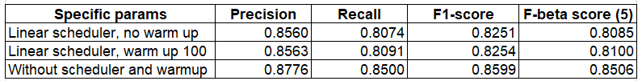

# PII-Detection
This repository provides functionality for training and inference models for Named Entity Recognition task based on Huggingface library, specified for dataset from "The Learning Agency Lab - PII Data Detection" kaggle competition. Link: https://www.kaggle.com/competitions/pii-detection-removal-from-educational-data
## Prerequisites
In today’s era of abundant educational data from sources such as ed tech, online learning, and research, widespread PII is a key challenge. PII’s presence is a barrier to analyze and create open datasets that advance education because releasing the data publicly puts students at risk. To reduce these risks, it’s crucial to screen and cleanse educational data for PII before public release, which data science could streamline.
## Setup
To setup all dependences please run  

    pip install -r requirements.txt

If you want to use pre-trained model from Huggingface you should have internet connection or folder with all model's data in Transformers format.
## Inference
In validation_utils folder you can find a function for posprocessing model's predictions and converting them to BIO format. That can be accepted for Kaggle submission.
## Training
To run training pipeline please use train.py script with next arguments are specified:  

    # model params
    parser.add_argument('--model_path', type=str, default='dslim/distilbert-NER',
    help='Path to pre-trained model. Can be link to model from Huggingface hub or to local folder in Transformers format.')
    parser.add_argument('--max_len', type=int, default=1024,
    help='Maximum lenght of sequence that can be passed throught model.')
    # data path
    parser.add_argument('--dataset_paths', nargs='+', type=str,
    help='Path or paths to training datasets in json format.')
    # batch size
    parser.add_argument('--batch_size', type=int, default=1,
    help='Train batch size. It is recommended to use 1 because of huge class disbalance')
    parser.add_argument('--val_batch_size', type=int, default=64)
    # training params
    parser.add_argument('--epochs', type=int, default=3)
    parser.add_argument('--lr', type=float, default=2e-5)
    parser.add_argument('--weight_decay', type=float, default=0.01)
    parser.add_argument('--acccum_step', type=int, default=1)
    # scheduler
    parser.add_argument('--enable_sched', type=bool, default=True)
    parser.add_argument('--warmup_steps', type=int, default=0)
    #device
    parser.add_argument('--device', type=str, default='cuda:0')

## Results
Some results on validation subsets of datasets:   https://www.kaggle.com/competitions/pii-detection-removal-from-educational-data/data  
https://www.kaggle.com/datasets/nbroad/pii-dd-mistral-generated  
Results was conducted using pre-trained dslim/distilbert-NER model from Huggingface with following hyperparameters:  
- Train batch size = 1
- Learning rate = 2e-5
- Weight decay = 0.01
- Epochs = 3
- Gradient accumulation step = 1

Another hyper-parameters specified in table:

